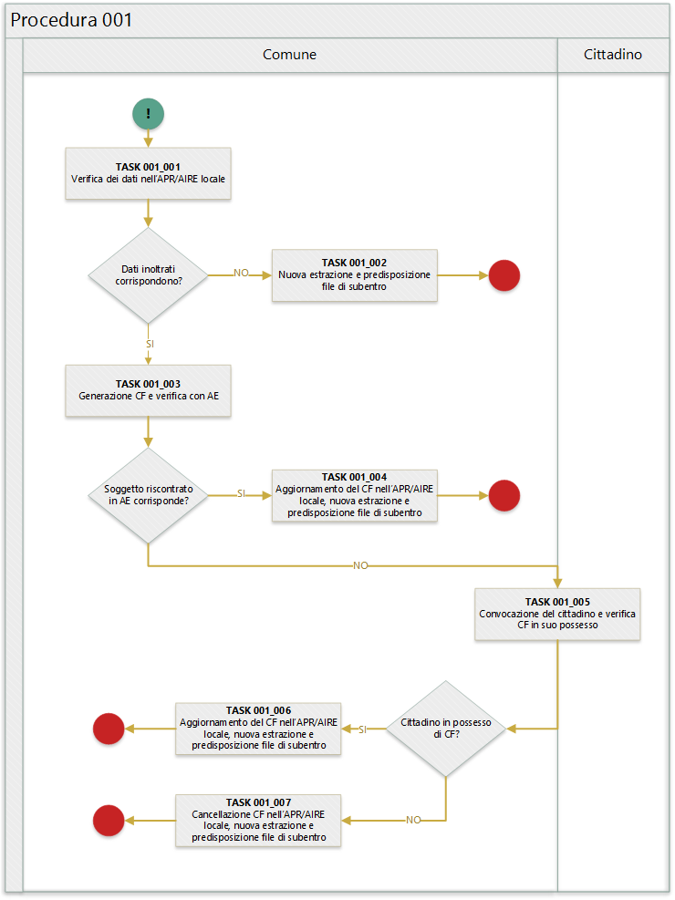

# Procedura 001
ritorna al [*README*](../README.md) / [*Tabella anomalie ANPR*](../TAB01_ANOMALIE_ANPR.md)

In quanto segue si riporta la procedura suggerita ai Comuni per la gestione delle anomalie: EA001, EA048.

## Swimlane diagram
La seguente figura sintetizza la procedura per la gestione delle anomalie.

## Descrizione task
In quanto segue si riporta una descrizione dei task previsti per la presente procedura.

### TASK 001_001
L'ufficiale d'anagrafe verifica i dati anagrafici associati al soggetto interessato dall'errore sul sistema gestionale del Comune (APR o AIRE locale) con l'obiettivo di constatare che i dati inoltrati al sistema ANPR coincidono con quelli registrati.

### TASK 001_002
Poichè i dati inoltrati al sistema ANPR non coincidono con quelli presenti nel sistema gestionale del Comune (probabilemente per problemi nella procedura di estrazione e predisposizione dei file di subentro utilizzata) è necessario provvedere nuovamente all'estrazione dei dati e alla predisposizione dei file di subentro al fine di provvedere ad eseguire nuovamente l'inoltro al sistema ANPR.

### TASK 001_003
L'ufficiale di anagrafe genera nuovamente il CF del soggetto rispettando le [regole di codifica](http://www.agenziaentrate.gov.it/wps/content/Nsilib/Nsi/Home/CosaDeviFare/Richiedere/Codice+fiscale+e+tessera+sanitaria/Richiesta+TS_CF/SchedaI/Informazioni+codificazione+pf/) è verifica, tramite il sistema SIATEL, l'attribuzione dello stesso da parte dell'AE.

ritorna al [*README*](../README.md) / [*Tabella anomalie ANPR*](../TAB01_ANOMALIE_ANPR.md)
 