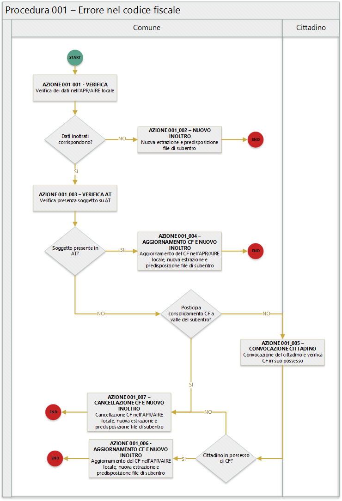

# Procedura 001

> ritorna [*README*](../README.md) o [*Tabella anomalie ANPR*](../TAB01_ANOMALIE_ANPR.md)

In quanto segue si riporta la procedura suggerita ai Comuni per la gestione delle anomalie: 

- EA001 - *codice fiscale* formalmente non corretto; 
- EA048 - *codice fiscale* formalmente errato.

## Precondizione
Per dare seguito alla presente procedura è necessario che l'ufficiale d'anagrafe disponga:

- accesso al sistema gestionale del Comune (APR o AIRE locale) con diritti di lettura e aggiornamento delle schede soggetto;
- accesso al sistema *SIATEL v2.0 - PuntoFisco* reso disponibile dall'Agenzia delle Entrate. 

## Diagramma della procedura
La seguente figura sintetizza la procedura per la gestione delle anomalie.

## Descrizione azione
In quanto segue si riporta una descrizione delle azioni previsti per la presente procedura.

### AZIONE 001_001
L'ufficiale d'anagrafe verifica i dati anagrafici associati al soggetto interessato dall'errore sul sistema gestionale del Comune (APR o AIRE locale) con l'obiettivo di constatare che i dati inoltrati al sistema ANPR coincidono con quelli registrati.

### AZIONE 001_002
Poichè i dati inoltrati al sistema ANPR non coincidono con quelli presenti nel sistema gestionale del Comune (probabilemente per problemi nella procedura di estrazione e predisposizione dei file di subentro utilizzata) è necessario provvedere nuovamente all'estrazione dei dati e alla predisposizione dei file di subentro al fine di provvedere ad eseguire l'inoltro al sistema ANPR.

### AZIONE 001_003
L'ufficiale di anagrafe genera nuovamente il *codice fiscale* del soggetto rispettando le [regole di codifica](http://www.agenziaentrate.gov.it/wps/content/Nsilib/Nsi/Home/CosaDeviFare/Richiedere/Codice+fiscale+e+tessera+sanitaria/Richiesta+TS_CF/SchedaI/Informazioni+codificazione+pf/) è verifica, tramite il sistema *SIATEL v2.0 - PuntoFisco* reso disponibile dall'Agenzia delle entrate, l'attribuzione dello stesso da parte dell'Agenzia delle entrate.

### AZIONE 001_004
L'ufficiale di anagrafe, a valle del positivo riscontro con l'Agenzia delle entrate, provvede ad aggiornare il *codice fiscale* sul sistema gestionale del Comune per dare seguito ad una nuova estrazione dei dati e alla predisposizione dei file di subentro al fine di provvedere ad eseguire l'inoltro al sistema ANPR.

### AZIONE 001_005
L'ufficiale di anagrafe convoca il cittadino per verificare se lo stesso è in possesso di un *codice fiscale* correttamente generato dall'Agenzia delle entrate.

### AZIONE 001_006
L'ufficiale di anagrafe, a valle del positivo riscontro con il cittadino, provvede ad aggiornare il *codice fiscale* sul sistema gestionale del Comune per dare seguito ad una nuova estrazione dei dati e alla predisposizione dei file di subentro al fine di provvedere ad eseguire l'inoltro al sistema ANPR.

### AZIONE 001_007
L'ufficiale di anagrafe, non avendo la possibilità di riscontrate il *codice fiscale* provvede alla cancellazione dei dati sul sistema gestionale del Comune per dare seguito ad una nuova estrazione dei dati e alla predisposizione dei file di subentro al fine di provvedere ad eseguire l'inoltro al sistema ANPR

## Riferimenti di interesse
Nello specifico della presente procedure risultano di interesse:

- [regole di codifica](http://www.agenziaentrate.gov.it/wps/content/Nsilib/Nsi/Home/CosaDeviFare/Richiedere/Codice+fiscale+e+tessera+sanitaria/Richiesta+TS_CF/SchedaI/Informazioni+codificazione+pf/) codice fiscale;

> ritorna [*README*](../README.md) o [*Tabella anomalie ANPR*](../TAB01_ANOMALIE_ANPR.md)
