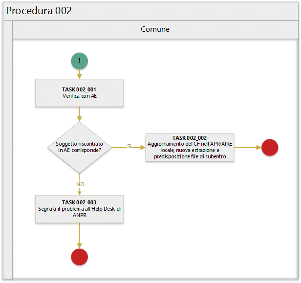

# Procedura 002

> ritorna [*README*](../README.md) o [*Tabella anomalie ANPR*](../TAB01_ANOMALIE_ANPR.md)

In quanto segue si riporta la procedura suggerita ai Comuni per la gestione delle anomalie: 

- EA002 - Soggetto presente in Anagrafe Tributaria con *dati angrafici* uguali a quelli del comune ma *codice fiscale* del comune assente; 
- EA003 - Soggetto presente in Anagrafe Tributaria con *dati angrafici* uguali a quelli del comune ma *codice fiscale* diverso.

## Precondizione
Per dare seguito alla presente procedura è necessario che l'ufficiale d'anagrafe disponga:

- accesso al sistema gestionale del Comune (APR o AIRE locale) con diritti di lettura e aggiornamento delle schede soggetto;
- accesso al sistema *SIATEL v2.0 - PuntoFisco* reso disponibile dall'Agenzia delle Entrate. 

## Diagramma della procedura
La seguente figura sintetizza la procedura per la gestione delle anomalie.

## Descrizione azione
In quanto segue si riporta una descrizione dei task previsti per la presente procedura.

### AZIONE 002_001
L'ufficiale di anagrafe verifica, tramite il sistema *SIATEL v2.0 - PuntoFisco* reso disponibile dall'Agenzia delle entrate, l'attribuzione dello stesso da parte dell'Agenzia delle entrate.

### AZIONE 002_002
L'ufficiale di anagrafe, a valle del positivo riscontro con l'Agenzia delle entrate, provvede ad aggiornare il *codice fiscale* sul sistema gestionale del Comune per dare seguito ad una nuova estrazione dei dati e alla predisposizione dei file di subentro al fine di provvedere ad eseguire l'inoltro al sistema ANPR.

### AZIONE 002_003
Nel caso in in cui l'ufficiale di anagrafe non riesca ad effettuare il riscontro del CF del soggetto tramite il sistema *SIATEL v2.0 - PuntoFisco* reso disponibile dall'Agenzia delle entrate, contatta l'Help Desk di ANPR per segnalare la circostanza.

## Riferimenti di interesse
Nello specifico della presente procedure risultano di interesse:

- [regole di codifica](http://www.agenziaentrate.gov.it/wps/content/Nsilib/Nsi/Home/CosaDeviFare/Richiedere/Codice+fiscale+e+tessera+sanitaria/Richiesta+TS_CF/SchedaI/Informazioni+codificazione+pf/) codice fiscale;

> ritorna [*README*](../README.md) o [*Tabella anomalie ANPR*](../TAB01_ANOMALIE_ANPR.md)
