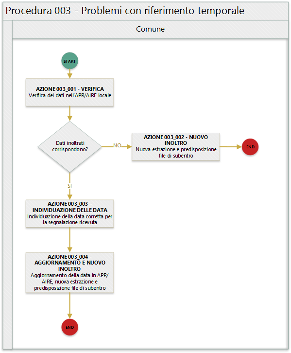

	QUESTO DOCUMENTO É UNA BOZZA DI LAVORO

# Procedura 003 - Problemi con riferimento temporale

> ritorna [*README*](../README.md) o [*Tabella anomalie ANPR*](../TAB01_ANOMALIE_ANPR.md)

In quanto segue si riporta la procedura suggerita ai Comuni per la gestione delle anomalie: 

- EHR69 - Anno dell'atto di nascita non valido;
- EHR70 - Anno dell'atto di morte non valido;
- EHR73 - Anno dell'atto di annullamento del matrimonio non valido;
- ES008 - Data nascita successiva alla data di richiesta;
- ES009 - Data validità cittadinanza deve essere maggiore uguale della data di nascita ma non a a quella corrente; 
- ES010 - Data matrimonio deve essere successiva alla data di nascita ma non a a quella corrente;
- ES012 - Data annullamento matrimonio deve essere successiva alla data di nascita ma non a a quella corrente;
- ES013 - Data formazione atto di nascita deve essere coincidente o successiva a quella di nascita ma non a a quella corrente;
- ES063 - La data nascita deve avere solo l'anno se il campo senzaGiornoMese è impostato a 1;
- ES066 - La data nascita deve avere solo il mese e l'anno se il campo senzaGiorno e' impostato a 1;
- ES078 - La data di decorrenza iscrizione AIRE deve essere maggiore uguale 01/07/1990 ma non a a quella corrente;
- ES079 - Anno espatrio deve essere maggiore uguale anno nascita e minore uguale anno corrente.

## Precondizione
Per dare seguito alla presente procedura è necessario che l'ufficiale d'anagrafe disponga della risoluzione dei valori ammessi nell'APR/AIRE locale con i codice previsti nelle tabelle di riferimento adottate da ANPR.

Si evidenzia che di norma il verificarsi di uno degli errori trattati dalla presente procedura riguardano la mappatura delle tabelle “interne” utilizzate dal software anagrafico in uso.  

## Diagramma della procedura
La seguente figura sintetizza la procedura per la gestione delle anomalie.

## Descrizione azione
In quanto segue si riporta una descrizione delle azioni previsti per la presente procedura.

### AZIONE 003_001 - VERIFICA
L'ufficiale d'anagrafe verifica i dati anagrafici associati al soggetto interessato dall'errore sul sistema gestionale del Comune (APR o AIRE locale) con l'obiettivo di constatare che i dati inoltrati al sistema ANPR coincidono con quelli registrati.

### AZIONE 003_002 – NUOVO INOLTRO
Poichè i dati inoltrati al sistema ANPR non coincidono con quelli presenti nel sistema gestionale del Comune (probabilemente per problemi nella procedura di estrazione e predisposizione dei file di subentro utilizzata) è necessario provvedere nuovamente all'estrazione dei dati e alla predisposizione dei file di subentro al fine di provvedere ad eseguire l'inoltro al sistema ANPR.

### AZIONE 003_003 – VERIFICA DELLA DATA
L'ufficiale di anagrafe determina il corretto valore per la data segnalata, se necessario anche attraverso il riscontro con gli atti di stato civile, e non da meno la coerenza della stessa con i riferimenti temporali degli altri eventi anagrafici da considerare, ad esempio nel caso dell'anomalia *EHR70 - Anno dell'atto di morte non valido* accerta che l'anno indicato sia non minore dell'anno di nascita del soggetto.

### AZIONE 003_004 - AGGIORNAMENTO E NUOVO INOLTRO
L'ufficiale di anagrafe, sulla base della verifica effettuata, provvede ad aggironare la *schede soggetto* e/o *schede famiglia*  sul sistema gestionale del Comune per dare seguito ad una nuova estrazione dei dati e alla predisposizione dei file di subentro al fine di provvedere ad eseguire l'inoltro al sistema ANPR.

> ritorna [*README*](../README.md) o [*Tabella anomalie ANPR*](../TAB01_ANOMALIE_ANPR.md)
