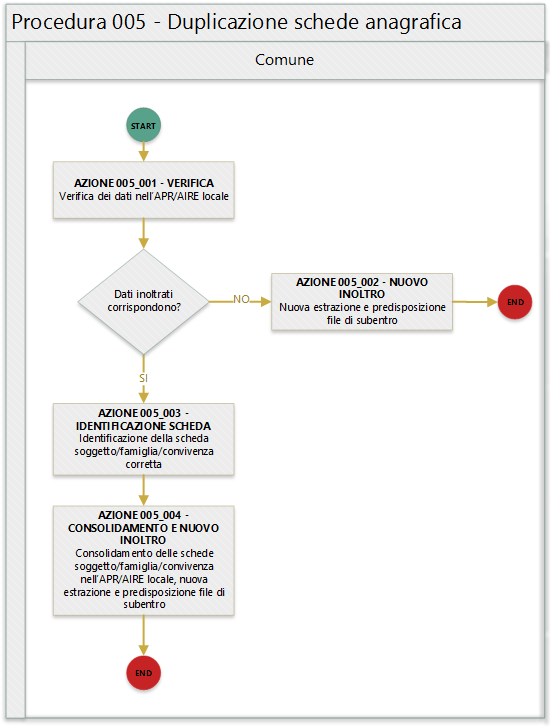

# Procedura 005

> ritorna [*README*](../README.md) o [*Tabella anomalie ANPR*](../TAB01_ANOMALIE_ANPR.md)

In quanto segue si riporta la procedura suggerita ai Comuni per la gestione delle anomalie: 

- EA030 - *codice fiscale* di un soggetto residente in piu' comuni
- EA031 - *codice fiscale* di un soggetto residente sia in Italia che all'estero (AIRE)

## Precondizione
Per dare seguito alla presente procedura è necessario che l'ufficiale d'anagrafe disponga:

- accesso al sistema gestionale del Comune (APR o AIRE locale) con diritti di lettura e aggiornamento delle schede soggetto.

## Diagramma della procedura
La seguente figura sintetizza la procedura per la gestione delle anomalie.

## Descrizione azione
In quanto segue si riporta una descrizione delle azioni previsti per la presente procedura.

### AZIONE 005_001
L'ufficiale di anagrafe verifica, tramite il sistema *SIATEL v2.0 - PuntoFisco* reso disponibile dall'Agenzia delle entrate, l'attribuzione dello stesso da parte dell'Agenzia delle entrate.

### AZIONE 005_002
L'ufficiale di anagrafe, a valle del riscontro che il *codice fiscale* conosciuto dall'Agenzia delle entrate non presente l'anomalia segnalata, provvede ad aggiornare il *codice fiscale* sul sistema gestionale del Comune per dare seguito ad una nuova estrazione dei dati e alla predisposizione dei file di subentro al fine di provvedere ad eseguire l'inoltro al sistema ANPR.

### AZIONE 005_003
L'ufficiale di anagrafe, o se necessario perchè coinvolti più comuni, realizza l'istgruttoria necessaria a confutare quale sia la scheda soggetto da considerare corretta.

### AZIONE 005_004
L'ufficiale di anagrafe, sulla base delle istruttoria realizzata, provvede a consolidare le *schede soggetto* sul sistema gestionale del Comune per dare seguito ad una nuova estrazione dei dati e alla predisposizione dei file di subentro al fine di provvedere ad eseguire l'inoltro al sistema ANPR.

> ritorna [*README*](../README.md) o [*Tabella anomalie ANPR*](../TAB01_ANOMALIE_ANPR.md)
