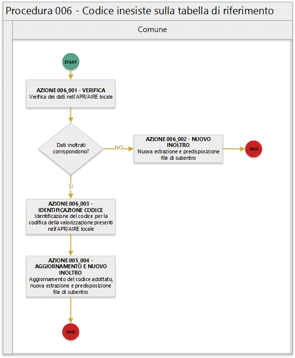

	QUESTO DOCUMENTO É UNA BOZZA DI LAVORO

# Procedura 006 - Codice inesistente su tabella di riferimento

> ritorna [*README*](../README.md) o [*Tabella anomalie ANPR*](../TAB01_ANOMALIE_ANPR.md)

In quanto segue si riporta la procedura suggerita ai Comuni per la gestione delle anomalie: 

- EC001 - Codice stato civile @ inesistente sulla tabella di riferimento [Tabella 1 Stato civile](https://anpr.readthedocs.io/en/latest/tab_stato_civile.html);
- EC002 - Codice relazione di parentela inesistente sulla tabella di riferimento [Tabella 5 Relazione di parentela](https://anpr.readthedocs.io/en/latest/tab_relazione_di_parentela___famiglia.html);
- EC003 - Codice legame scheda convivenza inesistente sulla tabella di riferimento [Tabella 6 Legame convivenza](https://anpr.readthedocs.io/en/latest/tab_legame____convivenza.html);
- EC004 - Codice motivo costituzione della famiglia inesistente sulla tabella di riferimento [Tabella 26 Motivo costituzione della famiglia](https://anpr.readthedocs.io/en/latest/tab_motivo_costituzione_della_famiglia.html);
- EC005 - Codice legame specie convivenza inesistente sulla tabella di riferimento [Tabella 27 Specie della convivenza](https://anpr.readthedocs.io/en/latest/tab_specie_della_convivenza.html);
- EC006 - Codice motivo iscrizione ANPR inesistente sulla tabella di riferimento [Tabella 7 Motivi di iscrizione in Anagrafe](https://anpr.readthedocs.io/en/latest/tab_motivi_di_iscrizione_in_anagrafe.html);
- EC007 - Comune/provincia di nascita inesistente o non valido alla data di nascita [Tabella 3 Comuni](https://anpr.readthedocs.io/en/latest/tab_tabella_03___comuni.html);	
- EC008 - Data di nascita non indicata - impossibile verificare la validita' del comune di nascita per la presenza di piu' occorrenze [Tabella 3 Comuni](https://anpr.readthedocs.io/en/latest/tab_tabella_03___comuni.html);
- EC009 - Codice ISTAT del comune di nascita incongruente con quello presente sulla tabella di riferimento [Tabella 3 Comuni](https://anpr.readthedocs.io/en/latest/tab_tabella_03___comuni.html);
- EC030 - Stato estero di nascita inesistente sulla [Tabella 2 Stati Esteri](https://anpr.readthedocs.io/en/latest/tab_stati_esteri.html);
- EC032 - Codice consolato di residenza inesistente sulla tabella di riferimento [Tabella 24 Elenco Consolati **NON PRESENTE SU [https://anpr.readthedocs.io/en/latest/](https://anpr.readthedocs.io/en/latest/)**]);
- EC036 -  Stato estero cittadinanza inesistente sulla tabella di riferimento: [Tabella 2 Stati Esteri](https://anpr.readthedocs.io/en/latest/tab_stati_esteri.html);
- EC042 - Comune/provincia di matrimonio inesistente;
- EC053 - Stato estero di residenza inesistente sulla tabella di riferimento [Tabella 2 Stati Esteri](https://anpr.readthedocs.io/en/latest/tab_stati_esteri.html);
- EC060 - Campo codice motivo iscrizione AIRE inesistente sulla tabella di riferimento [Tabella 19 Motivi iscrizione AIRE](https://anpr.readthedocs.io/en/latest/tab_motivi_iscrizione_aire.html);
- EC061 - Campo codice Iniziativa movimenti anagrafici AIRE inesistente sulla tabella di riferimento [Tabella 20 Iniziativa iscrizione AIRE](https://anpr.readthedocs.io/en/latest/tab_iniziativa_iscrizione_aire.html);
- EC062 - Campo codice Individuazione Comune Iscrizione AIRE inesistente sulla tabella di riferimento [Tabella 21 Individuazione del comune di iscrizione AIRE](http://anpr.readthedocs.io/en/latest/tab_individuazione_del_comune_di_iscrizione_aire.html);
- EC063 - Campo codice tipo soggiorno inesistente sulla tabella di riferimento [Tabella 8 Tipo Soggiorno](https://anpr.readthedocs.io/en/latest/tab_tipo_soggiorno.html);
- EC064 - Campo codice posizione nella professione inesistente sulla tabella di riferimento [Tabella 9 Posizione nella Professione](https://anpr.readthedocs.io/en/latest/tab_posizione_nella_professione.html);
- EC065 - Campo codice condizione non professione inesistente sulla tabella di riferimento [Tabella 10 Condizione non professionale](https://anpr.readthedocs.io/en/latest/tab_condizione_non_professionale.html);
- EC066 - Campo codice titolo di studio inesistente sulla tabella di riferimento [Tabella 11 Titolo di studio](https://anpr.readthedocs.io/en/latest/tab_titolo_di_studio.html);
- EC069 - Codice lingua inesistente sulla tabella di riferimento [Tabella 14 Lingue](https://anpr.readthedocs.io/en/latest/tab_lingue.html);
- EC073 - Codice specie Toponimo inesistente sulla tabella di riferimento [**NON PRESENTE SU [https://anpr.readthedocs.io/en/latest/](https://anpr.readthedocs.io/en/latest/)**];
- EC075 - Comune/provincia di registrazione atto di nascita inesistente o non valido alla data di registrazione [Tabella 3 Comuni](https://anpr.readthedocs.io/en/latest/tab_tabella_03___comuni.html);
- EC078 - Comune di rilascio carta identità inesistente o non valido alla data rilascio [Tabella 3 Comuni](https://anpr.readthedocs.io/en/latest/tab_tabella_03___comuni.html);
- EC081 - Comune/provincia di registrazione atto di matrimonio inesistente;
- EC087 - Comune di rilascio permesso di soggiorno inesistente o non valido alla data di rilascio [Tabella 3 Comuni](https://anpr.readthedocs.io/en/latest/tab_tabella_03___comuni.html);
- EC096 - Comune/provincia di registrazione atto di cessazione/annullamento matrimonio inesistente;
- EC164 - Codice stato istruttoria per accertamento espatrio non previsto. Indicare 1, 2 o 3 ;
- EC165 - Codice tipo fine unione non presente sulla tabella di riferimento [Tabella 31 Tipo cessazione matrimonio](https://anpr.readthedocs.io/en/latest/tab_tipo_cessazione_matrimonio.html);
- EN064 - Grado di parentela non più valido;
- EN242 - Codice tipo tribunale non valido, poichè non previsto in [Tabella 32 Tipo tribunale](https://anpr.readthedocs.io/en/latest/tab_tipo_tribunale.html);
- EN347 - Codice ISTAT utilizzato corrisponde a un codice di variazione

>**WARNING NON RISULTANO USATE LE TABELLE**
>
>- **Tabella 21 - Individuazione del comune di iscrizione AIRE**
>- **Tabella 25 - Tipo indirizzo**
>- **Tabella 32 - Tipo tribunale**
>- **Tabella 38 - Tipi cittadinanza**
>**WARNING DA VERIFICARE LE TABELLE**
>
>- **Tabella 33 - Conversione codici AIRE al subentro**
>
>**WARNING TABELLE NON PRESENTI SU DEVELOPERS**
>
>- **Tabella 4 - Toponimi**
>- **Tabella T_Elenco-Consolati**

## Precondizione
Per dare seguito alla presente procedura è necessario che l'ufficiale d'anagrafe disponga della codifica/valori ammessi nell'APR/AIRE locale con i codice previsti nelle tabelle di riferimento adottate da ANPR.

Si evidenzia che di norma il verificarsi di uno degli errori trattati dalla presente procedura riguardano la mappatura delle tabelle “interne” utilizzate dal software anagrafico in uso, tale circostanza evidenzia che l'ufficiale d'anagrafe ha la necessità di **lavorare in stretta sinergia con il proprio fornitore** per dare seguito alle necessarie attività di correzione delle anomalie. 

## Diagramma della procedura
La seguente figura sintetizza la procedura per la gestione delle anomalie.

## Descrizione azione
In quanto segue si riporta una descrizione delle azioni previsti per la presente procedura.

### AZIONE 006_001 - VERIFICA
L'ufficiale d'anagrafe verifica i dati anagrafici associati al soggetto interessato dall'errore sul sistema gestionale del Comune (APR o AIRE locale) con l'obiettivo di constatare che i dati inoltrati al sistema ANPR coincidono con quelli registrati.

### AZIONE 006_002 – NUOVO INOLTRO
Poichè i dati inoltrati al sistema ANPR non coincidono con quelli presenti nel sistema gestionale del Comune (probabilemente per problemi nella procedura di estrazione e predisposizione dei file di subentro utilizzata) è necessario provvedere nuovamente all'estrazione dei dati e alla predisposizione dei file di subentro al fine di provvedere ad eseguire l'inoltro al sistema ANPR.

### AZIONE 006_003 – IDENTIFICAZIONE CODICE

L'ufficiale di anagrafe identifica la corretta codifica del valore presente nell'APR/AIRE con il codice previsto dalla tabella di riferimento adottata da ANPR, ad esempio nel caso per l'indicazione della relazione di parentela in una famiglia nel caso in cui nell'APR/AIRE locali è presente "Nonno / Nonna" lo stesso andrà codificato con il valore 7.

Nello specifico dell'anomalia EN347 - Codice ISTAT utilizzato corrisponde a un codice di variazione si evidenzia che in questo caso il Comune ha utilizzato un codice di denominazione che identifica la denominazione precedente del comune. Tali codici, generati da ISTAT concatenando al codice della provincia a tre cifre un progressivo nell’intervallo 500-620, sono riportati nella colonna COD_DENOM della tabella di riferimento 03 e devono essere sostituiti con il corrispondente codice ISTAT riportato nella stessa tabella alla colonna CODISTAT della [tabella di riferimento 03](https://anpr.readthedocs.io/en/latest/tab_tabella_03___comuni.html) e devono essere sostituiti con i codici ISTAT riportati nella stessa tabella alla colonna CODISTAT.

### AZIONE 006_004 - AGGIORNAMENTO E NUOVO INOLTRO
L'ufficiale di anagrafe, sulla base dell'identificazione effettuata, provvede ad aggironare la *schede soggetto* e/o *schede famiglia*  sul sistema gestionale del Comune o ad assicurare la corretta transcodifica nella procedura di estrazione e predisposizione dei file di subentro, per dare seguito ad una nuova estrazione dei dati e alla predisposizione dei file di subentro al fine di provvedere ad eseguire l'inoltro al sistema ANPR.

## Riferimenti di interesse
Nello specifico della presente procedure risultano di interesse:

- [note all'utilizzo](https://docs.google.com/document/d/1QS2-HVwEKXC_vxL3qSrA2eePSDc_qR9TZbhBlKwtw80/edit) della tabella storico Comuni
- [note all'utilizzo](https://docs.google.com/document/d/1O8XAUMyRRq-YMcjzcuZlvQpQEl5wiq78rdHTRtBzZIs/edit) della tabella storico Stati Esteri

> ritorna [*README*](../README.md) o [*Tabella anomalie ANPR*](../TAB01_ANOMALIE_ANPR.md)
