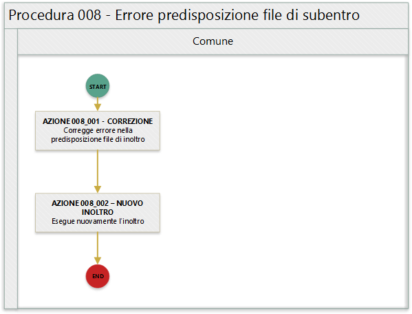

	QUESTO DOCUMENTO É UNA BOZZA DI LAVORO

# Procedura 008 - Errore predisposizione file di subentro

> ritorna [*README*](../README.md) o [*Tabella anomalie ANPR*](../TAB01_ANOMALIE_ANPR.md)

In quanto segue si riporta la procedura suggerita ai Comuni per la gestione delle anomalie: 

- EN001 - Nome file formalmente non corretto		
- EN002 - La dimensione del file compresso supera il valore consentito 
- EN007 - E' gia' presente un file con lo stesso nome 
- EN008 - Il numero progressivo indicato nel nome del file supera il totale previsto 
- EN009 - Il formato del file APR decompresso non e' XML		
- EN010 - Il formato del file AIRE decompresso non e' TXT			
- EN031 - I dati del gruppo "Dati Invio" devono essere obbligatoriamente impostati quando il totale invii >1	
- EN036 - File inviato non coerente con il Tipo file selezionato		
- EN038 - Il numero totale file da inviare indicato nel nome del file supera il totale previsto
- EN039 - Codice ISTAT del comune che invia il file incongruente con il codice ISTAT del comune indicato nel nome del file

## Precondizione
Si evidenzia che l'ufficiale d'anagrafe ha la necessità di **lavorare in stretta sinergia con il proprio fornitore** per dare seguito alle necessarie attività di correzione delle anomalie.

## Diagramma della procedura
La seguente figura sintetizza la procedura per la gestione delle anomalie.

## Descrizione azione
In quanto segue si riporta una descrizione delle azioni previsti per la presente procedura.

### AZIONE 008_001 - CORREZIONE
L'ufficiale d'anagrafe in base alla specifica anomalia segnalata provvedede a correggere la stessa, ad esempio nel caso dell'anomalia *EN009 - Il formato del file APR decompresso non e' XML* assicura che il file di presubentro sia un file xml ben formato, cioè:

- Il documento XML contiene un unico elemento root (“radice” dell’albero);
- Gli elementi devono essere sempre chiusi con tag di chiusura o, se vuoti, tramite chiusura abbreviata (/>);
- Bisogna rispettare l’ordine di nidificazione: un elemento padre non può essere chiuso prima di un elemento figli;
- XML è case sensitive: bisogna ricordarlo quando usiamo maiuscone e minuscole per nomi dei tag e attributi
- Gli attributi devono essere racchiusi tra singoli o doppi apici.

Inoltre assicura che il file rispetti lo schema xsd previsto. 

Si suggerisce che l’ufficiale d’anagrafe segnala al proprio fornitore l’errore rilevato da ANPR. 

Si ricorda che in ambiente di test-comuni nella sezione Strumenti di supporto, che compare in alto a destra sulla home page, è disponibile un client che consente la verifica del file xml per la migrazione dei dati dall'APR locale alla base dati ANPR.

### AZIONE 008_002 – NUOVO INOLTRO
A valle della correzione del file di subentro è necessario provvedere nuovamente ad eseguire l'inoltro al sistema ANPR.

## Riferimenti di interesse
Nello specifico della presente procedure risultano di interesse:

- Documento Invio file di subentro ANPR;

> ritorna [*README*](../README.md) o [*Tabella anomalie ANPR*](../TAB01_ANOMALIE_ANPR.md)
